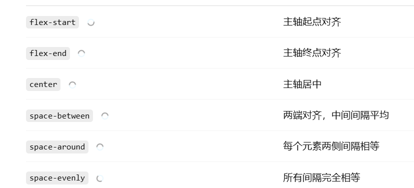
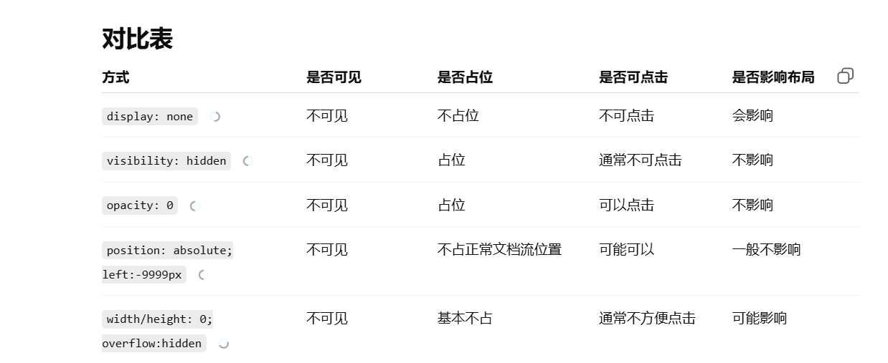

#### 1. DOCTYPE 是什么？严格模式 & 混杂模式怎么触发？

DOCTYPE 是文档类型声明，用来告诉浏览器以标准模式解析和渲染页面。
HTML5 的写法是：

```html
<!DOCTYPE html>
```

标准模式：浏览器按照现代 Web 标准渲染页面。
怪异模式：浏览器为了兼容早期老页面，会采用一些非标准规则渲染。

如果 HTML 文档开头写了正确的 <!DOCTYPE html>，通常会进入标准模式；
如果没有写 DOCTYPE 或声明不正确，浏览器可能进入怪异模式。

#### 2. HTML 语义化是什么？为什么要语义化？


#### 3. 盒模型是什么？标准盒模型 & IE 盒模型区别？


#### 4. 行内元素、块级元素有哪些？区别是什么？


#### 5. CSS 选择器优先级怎么算？


#### 6. `display: none` 和 `visibility: hidden` 区别？


#### 7. BFC 是什么？怎么触发？能解决什么问题？


#### 8. 如何实现水平垂直居中？

- flex
- 定位
- grid
- 单行文本

#### 9. Flex 布局常用属性有哪些？

- 容器

  - flex-dirction（row|colum） 主轴方向

  - justify-content：主轴对齐方式（center）

    

  - align-item
  - align-content
  - flex-wrap

- 项目

  - order
  - align-self
  - flex


#### 10. 常见 CSS 布局：左固定宽，右自适应有几种实现？


#### 11. 移动端 1px 问题怎么解决？


#### 12. CSS 中 `link` 和 `@import` 区别？

```
link：HTML 标签，加载早，性能好，功能多，可被 JS 操作
@import：CSS 语法，加载晚，只能引 CSS，性能较差
```


#### 13. 如何隐藏一个元素？各种方式有什么区别？




#### 14. CSS Sprites（精灵图）是什么？优缺点？

```
精灵图：多张小图合成一张大图
显示方式：background-image + background-position
优点：减少请求
缺点：维护麻烦，不够灵活
```

#### 15. 响应式布局有哪些方案？
