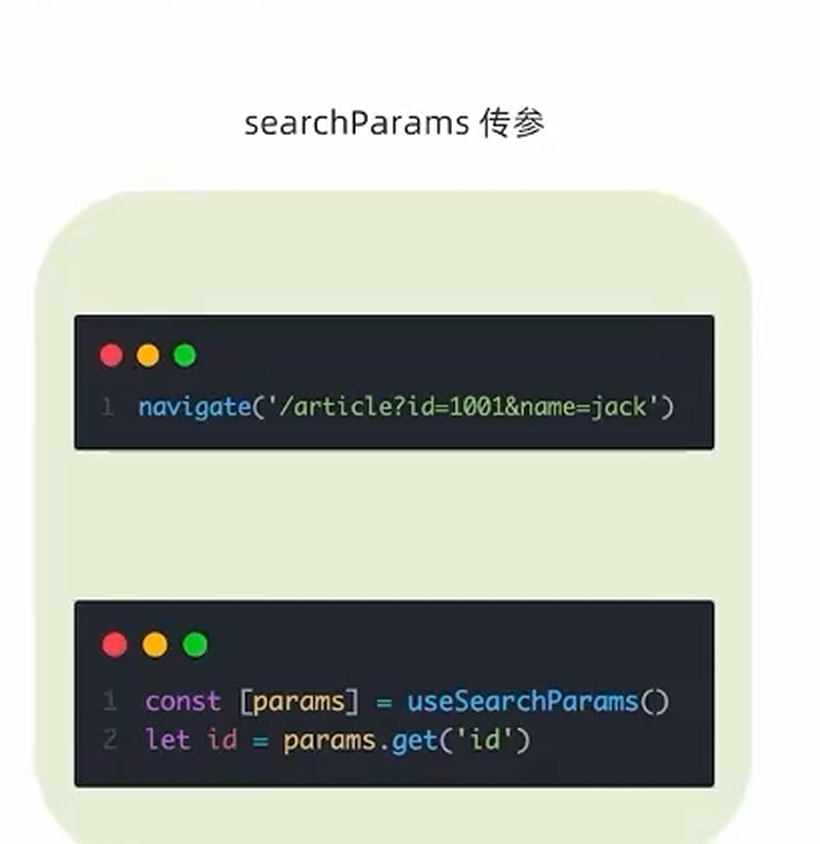

# React 学习笔记

## 1. 什么是 JSX

JSX 全称是 `JavaScript XML`，它允许我们在 JavaScript 中直接写类似 HTML 的结构。

例如：

```jsx
const element = <h1>Hello React</h1>;
```

它看起来像 HTML，但本质上不是字符串，也不是浏览器原生语法，而是会被编译工具转换成 JavaScript。

例如上面的代码最终会被转换成类似这样的形式：

```js
const element = React.createElement('h1', null, 'Hello React');
```

可以这样理解：

- HTML 是给浏览器直接解析的
- JSX 是给 React 写界面的语法糖
- React 再把它转换成浏览器能识别的内容

## 2. JSX 怎么用

JSX 常见写法和 HTML 很像，但有几个重要区别。

### 2.1 基本写法

```jsx
function App() {
  return (
    <div>
      <h1>欢迎学习 React</h1>
      <p>这是一个 JSX 示例</p>
    </div>
  );
}
```

注意：

- JSX 必须有一个根元素
- 标签必须正确闭合
- 可以在 `{}` 中写 JavaScript 表达式

### 2.2 在 JSX 中使用表达式

```jsx
function App() {
  const name = 'Tom';
  const age = 18;

  return <h1>{name} - {age}</h1>;
}
```

`{}` 中可以放：

- 变量
- 运算表达式
- 函数调用结果
- 三元表达式

不能直接放：

- `if`
- `for`
- 普通对象本身

例如：

```jsx
const user = { name: 'Tom' };

return <div>{user.name}</div>;
```

而不是：

```jsx
return <div>{user}</div>;
```

## 3. JSX 实现列表渲染

React 中渲染列表最常用的是 `map()`。

```jsx
function App() {
  const list = [
    { id: 1, name: 'Vue' },
    { id: 2, name: 'React' },
    { id: 3, name: 'Angular' }
  ];

  return (
    <ul>
      {list.map((item) => (
        <li key={item.id}>{item.name}</li>
      ))}
    </ul>
  );
}
```

重点：

- 列表渲染通常配合 `map()` 使用
- 每一项都应该有 `key`
- `key` 要稳定且唯一，优先使用数据里的 `id`

为什么要有 `key`：

- 方便 React 比较新旧节点
- 减少不必要的 DOM 更新
- 避免界面错乱

不推荐这样写：

```jsx
<li key={index}>{item.name}</li>
```

如果列表会增删改、排序，`index` 可能导致状态错位。

## 4. JSX 条件渲染

React 中没有模板指令，比如 `v-if`，一般使用 JavaScript 表达式做条件渲染。

### 4.1 三元表达式

```jsx
function App() {
  const isLogin = true;

  return <div>{isLogin ? '欢迎回来' : '请先登录'}</div>;
}
```

适合：

- 有两种明确结果的场景

### 4.2 逻辑与 `&&`

```jsx
function App() {
  const isAdmin = true;

  return <div>{isAdmin && <button>删除用户</button>}</div>;
}
```

适合：

- 只在条件成立时显示某个内容

## 5. JSX 复杂条件渲染

当条件很多时，不建议把大量判断直接堆在 JSX 里，否则可读性会很差。

### 5.1 提前处理变量

```jsx
function App() {
  const status = 'loading';

  let content = null;

  if (status === 'loading') {
    content = <p>加载中...</p>;
  } else if (status === 'success') {
    content = <p>加载成功</p>;
  } else {
    content = <p>加载失败</p>;
  }

  return <div>{content}</div>;
}
```

### 5.2 抽成函数

```jsx
function App() {
  const status = 'success';

  const renderContent = () => {
    switch (status) {
      case 'loading':
        return <p>加载中...</p>;
      case 'success':
        return <p>加载成功</p>;
      default:
        return <p>加载失败</p>;
    }
  };

  return <div>{renderContent()}</div>;
}
```

建议：

- 简单判断用三元表达式
- 单边显示用 `&&`
- 多分支判断提前写到 JSX 外部

## 6. 基础事件绑定

React 事件绑定使用驼峰命名，事件处理函数一般写成函数引用。

```jsx
function App() {
  const handleClick = () => {
    console.log('按钮被点击了');
  };

  return <button onClick={handleClick}>点击</button>;
}
```

### 6.1 传递参数

```jsx
function App() {
  const handleClick = (name) => {
    console.log(name);
  };

  return <button onClick={() => handleClick('Tom')}>点击</button>;
}
```

### 6.2 获取事件对象

```jsx
function App() {
  const handleClick = (e) => {
    console.log(e);
  };

  return <button onClick={handleClick}>点击</button>;
}
```

如果同时要传参和拿事件对象：

```jsx
<button onClick={(e) => handleClick('Tom', e)}>点击</button>
```

## 7. 组件基础使用

React 组件本质上就是一段可以复用的 UI。

常见组件写法是函数组件。

```jsx
function Hello() {
  return <h2>Hello Component</h2>;
}

function App() {
  return (
    <div>
      <Hello />
    </div>
  );
}
```

组件使用规则：

- 组件名必须大写
- 组件必须返回 JSX 或 `null`
- 一个组件可以在多个地方复用

组件的价值：

- 拆分界面
- 复用结构
- 隔离逻辑

## 8. useState 基础使用

`useState` 用来给函数组件添加状态。

```jsx
import { useState } from 'react';

function App() {
  const [count, setCount] = useState(0);

  return (
    <div>
      <p>{count}</p>
      <button onClick={() => setCount(count + 1)}>+1</button>
    </div>
  );
}
```

解释：

- `count`：当前状态值
- `setCount`：修改状态的方法
- `useState(0)`：状态初始值是 `0`

状态变化后：

- React 会重新执行组件函数
- 页面会根据新状态重新渲染

## 9. useState 修改状态的规则

### 9.1 状态不可变

React 中不要直接修改原来的状态，而是要基于旧状态创建新状态。

错误写法：

```jsx
const [user, setUser] = useState({ name: 'Tom', age: 18 });

user.age = 20;
setUser(user);
```

正确写法：

```jsx
setUser({
  ...user,
  age: 20
});
```

如果状态是数组：

```jsx
const [list, setList] = useState([1, 2, 3]);

setList([...list, 4]);
```

### 9.2 修改依赖旧值时优先使用函数写法

```jsx
setCount((prev) => prev + 1);
```

这种写法更适合：

- 连续更新
- 新状态依赖旧状态

### 9.3 不要在渲染过程中修改状态

下面这种写法会造成死循环：

```jsx
function App() {
  const [count, setCount] = useState(0);

  setCount(count + 1);

  return <div>{count}</div>;
}
```

修改状态应该放在：

- 事件回调中
- `useEffect` 中
- 异步逻辑里

## 10. 基础样式控制

React 中控制样式的常见方式有两种：行内样式和类名控制。

### 10.1 行内样式

React 的行内样式写法是对象。

```jsx
function App() {
  return (
    <div
      style={{
        color: 'red',
        fontSize: '20px'
      }}
    >
      这是红色文字
    </div>
  );
}
```

注意：

- `style` 接收的是对象，不是字符串
- CSS 属性名使用小驼峰，如 `fontSize`

### 10.2 class 类名

```jsx
import './app.css';

function App() {
  return <div className="box">这是一个盒子</div>;
}
```

注意：

- React 中不能写 `class`
- 要写成 `className`

## 11. classnames、clsx 优化类名控制

当类名需要根据条件动态切换时，直接拼字符串会比较乱。

例如：

```jsx
function App() {
  const isActive = true;

  return <div className={isActive ? 'tab active' : 'tab'}>内容</div>;
}
```

类名更多时可以使用 `classnames` 或 `clsx`。

```jsx
import clsx from 'clsx';

function App() {
  const isActive = true;
  const isDisabled = false;

  return (
    <button
      className={clsx('btn', {
        active: isActive,
        disabled: isDisabled
      })}
    >
      按钮
    </button>
  );
}
```

优点：

- 条件类名更清晰
- 避免手写字符串拼接
- 维护复杂样式更方便

## 12. 受控表单绑定

受控组件指的是：表单的值由 React 状态控制。

```jsx
import { useState } from 'react';

function App() {
  const [value, setValue] = useState('');

  return (
    <input
      value={value}
      onChange={(e) => setValue(e.target.value)}
      placeholder="请输入内容"
    />
  );
}
```

解释：

- `value` 由状态提供
- `onChange` 在输入变化时同步更新状态
- 输入框显示什么，完全由 React 决定

文本域和下拉框也是同样思路：

```jsx
const [city, setCity] = useState('beijing');

<select value={city} onChange={(e) => setCity(e.target.value)}>
  <option value="beijing">北京</option>
  <option value="shanghai">上海</option>
</select>
```

## 13. React 中获取 DOM

React 中如果要拿到真实 DOM，一般使用 `useRef`。

```jsx
import { useEffect, useRef } from 'react';

function App() {
  const inputRef = useRef(null);

  useEffect(() => {
    inputRef.current.focus();
  }, []);

  return <input ref={inputRef} />;
}
```

说明：

- `useRef(null)` 创建一个引用对象
- `ref={inputRef}` 绑定到 DOM
- DOM 挂载完成后可以通过 `inputRef.current` 获取真实节点

常见用途：

- 获取焦点
- 滚动到某个位置
- 调用原生 DOM API

## 14. 组件通信

React 是单向数据流，数据通常从父组件流向子组件。不同组件之间通信要选择合适方式。

### 14.1 父传子：props

```jsx
function Son(props) {
  return <div>我收到的数据是：{props.title}</div>;
}

function App() {
  return <Son title="这是父组件传来的数据" />;
}
```

`props` 可以传：

- 字符串
- 数字
- 布尔值
- 对象
- 数组
- 函数
- JSX

### 14.2 父传子：children

`children` 是组件标签体中的内容。

```jsx
function Layout({ children }) {
  return <div className="layout">{children}</div>;
}

function App() {
  return (
    <Layout>
      <h1>这里是页面标题</h1>
      <p>这里是页面内容</p>
    </Layout>
  );
}
```

### 14.3 子传父：函数

子组件不能直接改父组件状态，但父组件可以把函数传给子组件，让子组件调用。

```jsx
function Son({ onSend }) {
  return <button onClick={() => onSend('子组件的数据')}>发送数据</button>;
}

function App() {
  const handleReceive = (msg) => {
    console.log(msg);
  };

  return <Son onSend={handleReceive} />;
}
```

### 14.4 兄弟组件通信

兄弟组件通常通过共同的父组件中转。

思路：

- 把共享状态提升到父组件
- 一个子组件修改状态
- 另一个子组件通过 props 获取状态

这就是“状态提升”。

### 14.5 跨层组件通信：context

如果组件层级很深，一层层传 props 会比较麻烦，这时可以用 `context`。

```jsx
import { createContext, useContext } from 'react';

const ThemeContext = createContext('light');

function Child() {
  const theme = useContext(ThemeContext);
  return <div>当前主题：{theme}</div>;
}

function App() {
  return (
    <ThemeContext.Provider value="dark">
      <Child />
    </ThemeContext.Provider>
  );
}
```

适合：

- 主题
- 登录信息
- 多层公共配置

## 15. useEffect

`useEffect` 用来处理副作用。

所谓副作用，可以理解成组件渲染之外额外做的事情，例如：

- 发送请求
- 操作 DOM
- 订阅事件
- 开启定时器

### 15.1 基础使用

```jsx
import { useEffect } from 'react';

function App() {
  useEffect(() => {
    console.log('组件渲染后执行');
  });

  return <div>Hello</div>;
}
```

默认情况下，不写依赖数组，组件每次渲染后都会执行。

### 15.2 不同依赖项

#### 不写依赖数组

```jsx
useEffect(() => {
  console.log('每次渲染后都执行');
});
```

#### 依赖数组为空

```jsx
useEffect(() => {
  console.log('只在首次挂载时执行');
}, []);
```

#### 依赖某个值

```jsx
useEffect(() => {
  console.log('count 变化时执行');
}, [count]);
```

### 15.3 清除副作用

如果副作用需要清理，可以在 `useEffect` 中返回一个函数。

```jsx
useEffect(() => {
  const timer = setInterval(() => {
    console.log('定时器执行中');
  }, 1000);

  return () => {
    clearInterval(timer);
  };
}, []);
```

常见清理场景：

- 清除定时器
- 解绑事件
- 取消订阅

## 16. 自定义 Hooks

自定义 Hook 本质上就是把可复用的状态逻辑提取成函数。

约定：

- 名称必须以 `use` 开头
- 内部可以使用其他 Hook

例如封装一个获取窗口宽度的 Hook：

```jsx
import { useEffect, useState } from 'react';

function useWindowSize() {
  const [width, setWidth] = useState(window.innerWidth);

  useEffect(() => {
    const handleResize = () => {
      setWidth(window.innerWidth);
    };

    window.addEventListener('resize', handleResize);

    return () => {
      window.removeEventListener('resize', handleResize);
    };
  }, []);

  return width;
}
```

使用：

```jsx
function App() {
  const width = useWindowSize();

  return <div>当前窗口宽度：{width}</div>;
}
```

好处：

- 逻辑复用
- 减少重复代码
- 让组件更专注于界面

## 17. useCallback

`useCallback` 用来缓存函数本身。

```jsx
import { useCallback, useState } from 'react';

function App() {
  const [count, setCount] = useState(0);

  const handleAdd = useCallback(() => {
    setCount((prev) => prev + 1);
  }, []);

  return <button onClick={handleAdd}>{count}</button>;
}
```

它的作用不是“让函数更快”，而是：

- 在依赖不变时，返回同一个函数引用
- 避免子组件因为函数引用变化而重复渲染

常见使用场景：

- 函数作为 props 传给子组件
- 配合 `memo` 优化渲染

不要滥用：

- 简单场景下直接写函数通常更自然
- 过度使用会增加理解成本

## 18. useMemo

`useMemo` 用来缓存计算结果。

```jsx
import { useMemo, useState } from 'react';

function App() {
  const [count, setCount] = useState(0);
  const [input, setInput] = useState('');

  const doubleCount = useMemo(() => {
    return count * 2;
  }, [count]);

  return (
    <div>
      <p>{doubleCount}</p>
      <input value={input} onChange={(e) => setInput(e.target.value)} />
      <button onClick={() => setCount(count + 1)}>+1</button>
    </div>
  );
}
```

适合：

- 计算量较大的派生值
- 依赖项不变时不希望重复计算

和 `useCallback` 的区别：

- `useCallback` 缓存函数
- `useMemo` 缓存函数执行结果

## 19. React Hooks 使用规则

Hooks 不是随便哪里都能调用，有固定规则。

### 19.1 只在函数组件或自定义 Hook 中调用

正确：

```jsx
function App() {
  const [count, setCount] = useState(0);
  return <div>{count}</div>;
}
```

错误：

```jsx
function handleClick() {
  const [count, setCount] = useState(0);
}
```

### 19.2 只能在顶层调用

不要在以下位置调用 Hook：

- `if` 语句里
- `for` 循环里
- 普通函数里
- 嵌套函数里

错误示例：

```jsx
if (flag) {
  useEffect(() => {});
}
```

原因：

- React 依赖 Hook 调用顺序来匹配状态
- 调用顺序变化会导致状态错乱

## 20. Redux 基本概念

Redux 是一种集中式状态管理方案，适合管理多个组件共享的数据。

核心概念可以先记住这几个：

- `store`：保存全局状态的地方
- `state`：实际数据
- `action`：描述“要做什么”
- `reducer`：根据 `action` 计算新状态
- `dispatch`：触发一次状态更新

流程可以理解成：

1. 组件通过 `dispatch(action)` 发出动作
2. `reducer` 根据动作修改状态
3. `store` 保存新状态
4. React 组件读取新状态并重新渲染

现在实际开发中更推荐使用 `Redux Toolkit`，因为它对 Redux 做了更简洁的封装。

## 21. Redux 在 React 中使用环境准备

推荐安装：

```bash
npm install @reduxjs/toolkit react-redux
```

一个常见目录结构如下：

```txt
src
|-- store
|   |-- index.js
|   |-- modules
|       |-- counterStore.js
|-- main.jsx
```

### 21.1 目录准备

#### `src/store/modules/counterStore.js`

```js
import { createSlice } from '@reduxjs/toolkit';

const counterStore = createSlice({
  name: 'counter',
  initialState: {
    count: 0
  },
  reducers: {
    increment(state) {
      state.count += 1;
    },
    addCount(state, action) {
      state.count += action.payload;
    }
  }
});

export const { increment, addCount } = counterStore.actions;
export default counterStore.reducer;
```

#### `src/store/index.js`

```js
import { configureStore } from '@reduxjs/toolkit';
import counterReducer from './modules/counterStore';

const store = configureStore({
  reducer: {
    counter: counterReducer
  }
});

export default store;
```

#### `src/main.jsx`

```jsx
import React from 'react';
import ReactDOM from 'react-dom/client';
import { Provider } from 'react-redux';
import App from './App';
import store from './store';

ReactDOM.createRoot(document.getElementById('root')).render(
  <Provider store={store}>
    <App />
  </Provider>
);
```

### 21.2 基本使用

组件中通过 `useSelector` 读取状态，通过 `useDispatch` 派发动作。

```jsx
import { useDispatch, useSelector } from 'react-redux';
import { increment, addCount } from './store/modules/counterStore';

function App() {
  const count = useSelector((state) => state.counter.count);
  const dispatch = useDispatch();

  return (
    <div>
      <p>{count}</p>
      <button onClick={() => dispatch(increment())}>+1</button>
      <button onClick={() => dispatch(addCount(10))}>+10</button>
    </div>
  );
}
```

### 21.3 异步状态处理

异步逻辑通常放在 action 函数里处理，再在成功后派发同步 action。

例如：

```js
import { createSlice } from '@reduxjs/toolkit';

const channelStore = createSlice({
  name: 'channel',
  initialState: {
    list: []
  },
  reducers: {
    setList(state, action) {
      state.list = action.payload;
    }
  }
});

const { setList } = channelStore.actions;

const fetchChannelList = () => {
  return async (dispatch) => {
    const res = await fetch('/api/channels');
    const data = await res.json();
    dispatch(setList(data));
  };
};

export { fetchChannelList };
export default channelStore.reducer;
```

组件里调用：

```jsx
useEffect(() => {
  dispatch(fetchChannelList());
}, [dispatch]);
```

## 22. React Router 路由

React Router 用来实现前端单页应用中的页面切换。

推荐安装：

```bash
npm install react-router-dom
```

### 22.1 简单使用

```jsx
import { BrowserRouter, Link, Route, Routes } from 'react-router-dom';

function Home() {
  return <h2>首页</h2>;
}

function About() {
  return <h2>关于页</h2>;
}

function App() {
  return (
    <BrowserRouter>
      <Link to="/">首页</Link>
      <Link to="/about">关于</Link>

      <Routes>
        <Route path="/" element={<Home />} />
        <Route path="/about" element={<About />} />
      </Routes>
    </BrowserRouter>
  );
}
```

常见角色：

- `BrowserRouter`：包裹整个应用
- `Routes`：路由出口容器
- `Route`：定义具体路径和组件
- `Link`：路由跳转链接

### 22.2 抽象路由模块

项目稍大时，通常会把路由配置单独抽出来。

例如：

#### `src/router/index.jsx`

```jsx
import Home from '../pages/Home';
import About from '../pages/About';

const routes = [
  {
    path: '/',
    element: <Home />
  },
  {
    path: '/about',
    element: <About />
  }
];

export default routes;
```

然后配合 `useRoutes` 使用：

```jsx
import { BrowserRouter, useRoutes } from 'react-router-dom';
import routes from './router';

function WrapperRoutes() {
  return useRoutes(routes);
}

function App() {
  return (
    <BrowserRouter>
      <WrapperRoutes />
    </BrowserRouter>
  );
}
```

### 22.3 路由导航

#### 声明式导航

使用 `Link` 或 `NavLink`。

```jsx
<Link to="/about">跳转到关于页</Link>
```

`NavLink` 适合导航菜单，因为它可以根据当前路由自动添加激活样式。

#### 编程式导航

使用 `useNavigate`。

```jsx
import { useNavigate } from 'react-router-dom';

function Login() {
  const navigate = useNavigate();

  const handleLogin = () => {
    navigate('/home');
  };

  return <button onClick={handleLogin}>登录后跳转</button>;
}
```

也可以后退：

```jsx
navigate(-1);
```

### 22.4 常见补充

#### 路由参数

```jsx
<Route path="/article/:id" element={<Article />} />
```

获取参数：

```jsx
import { useParams } from 'react-router-dom';

function Article() {
  const { id } = useParams();
  return <div>文章 id：{id}</div>;
}
```



```
useSearchParams()
```


#### 嵌套路由

```jsx
<Route path="/layout" element={<Layout />}>
  <Route path="home" element={<Home />} />
  <Route path="about" element={<About />} />
</Route>
```

父组件中要提供出口：

```jsx
import { Outlet } from 'react-router-dom';

function Layout() {
  return (
    <div>
      <h1>布局页</h1>
      <Outlet />
    </div>
  );
}
```

抽象路由模块中的嵌套路由


默认二级路由


两种路由模式


路由守卫


打包


配置路由懒加载
