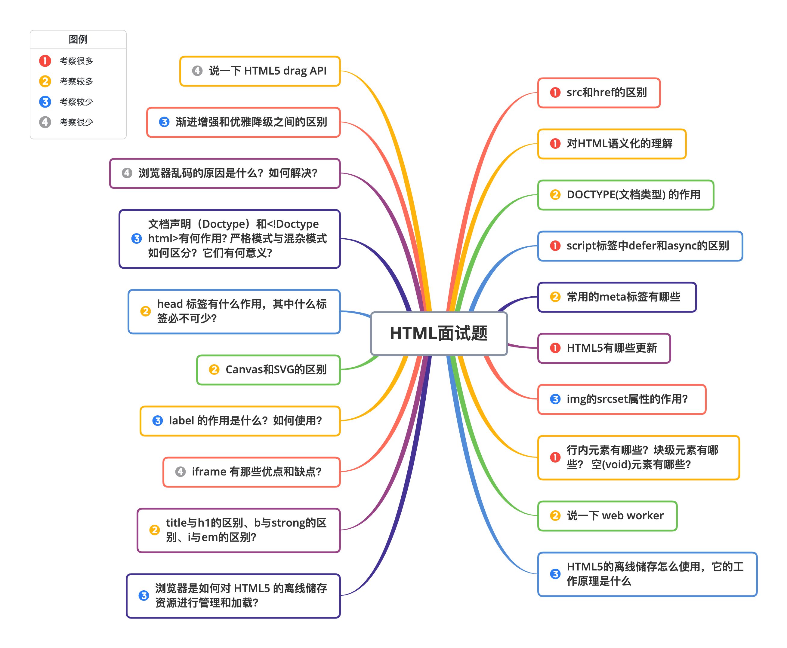
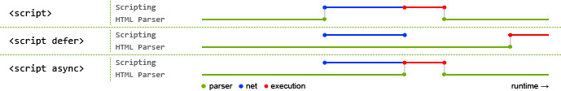

# 前端面试 HTML篇

> 来源参考：[w3cschool《前端面试八股文 - HTML篇》](https://www.w3cschool.cn/web_interview/web_interview-5pv93ptv.html)  
> 说明：本文按原篇章结构整理，标题附加了思维导图中的优先级信息。优先级含义：1 = 考察很多，2 = 考较多，3 = 考较少，4 = 考很少。



## 1. src和href的区别（优先级 1：考察很多）

`src` 和 `href` 都用于引用外部资源，但语义和加载行为不同。

- `src` 表示“嵌入资源”。浏览器解析到 `src` 时，会把目标资源下载并替换到当前标签所在位置，例如 `script`、`img`、`iframe`。当浏览器解析到外部脚本 `src` 时，通常会暂停后续文档解析，直到脚本加载并执行完成。
- `href` 表示“建立关联”。它用于声明当前文档与外部资源的关系，例如 `link`、`a`。浏览器遇到 CSS 的 `href` 时会并行下载资源，不会像普通脚本那样直接阻塞 HTML 解析。

常见记忆方式：`src` 是把资源放进页面，`href` 是让页面和资源建立联系。

## 2. 对HTML语义化的理解（优先级 1：考察很多）

HTML 语义化是指根据内容含义选择合适的标签，也就是“用正确的标签表达正确的内容”。它关注的不是页面外观，而是文档结构和信息含义。

语义化的优点：

- 代码结构更清晰，便于团队维护。
- 对搜索引擎更友好，有助于 SEO。
- 对屏幕阅读器等辅助设备更友好，提升可访问性。
- 即使 CSS 加载失败，页面仍能保留较合理的内容结构。

常见语义化标签：

- `header`：页头或区块头部。
- `nav`：导航区域。
- `main`：页面主体内容。
- `article`：独立文章或内容块。
- `section`：页面中的主题区块。
- `aside`：侧边栏或补充信息。
- `footer`：页脚或区块底部。

## 3. DOCTYPE(文档类型) 的作用（优先级 2：考较多）

`DOCTYPE` 是文档类型声明，用于告诉浏览器应该按照哪一种 HTML 规范解析当前页面。它应放在 HTML 文档的第一行。

HTML5 中通常写作：

```html
<!DOCTYPE html>
```

浏览器渲染页面时主要有两种模式：

- 标准模式：浏览器尽量按照 W3C 标准解析和渲染页面，`document.compatMode` 通常为 `CSS1Compat`。
- 怪异模式：浏览器模拟旧版本浏览器的非标准行为，常用于兼容历史页面，`document.compatMode` 通常为 `BackCompat`。

缺失或错误的 `DOCTYPE` 可能导致页面进入怪异模式，从而出现盒模型、尺寸计算等兼容问题。

## 4. script标签中defer和async的区别（优先级 1：考察很多）

普通外部脚本、`defer`、`async` 都会影响 HTML 解析与脚本执行的顺序。



图中可以理解为：HTML 解析、脚本下载、脚本执行三件事在不同属性下的排列不同。

- 普通 `script`：浏览器遇到脚本后会暂停 HTML 解析，先下载并执行脚本，之后再继续解析。
- `defer`：脚本异步下载，不阻塞 HTML 解析；等 HTML 解析完成后、`DOMContentLoaded` 触发前，按文档顺序执行。
- `async`：脚本异步下载，不阻塞 HTML 解析；下载完成后立即执行，执行时会暂停 HTML 解析，多个 `async` 脚本执行顺序不固定。

适用场景：

- 依赖 DOM 或依赖脚本顺序时，优先考虑 `defer`。
- 独立脚本，例如统计、广告、埋点，适合使用 `async`。

## 5. 常用的meta标签有哪些（优先级 2：考较多）

`meta` 标签用于描述 HTML 文档的元信息，常放在 `head` 中。它不会直接展示在页面上，但会影响编码、搜索引擎、移动端视口等行为。

### 5.1 charset

声明页面字符编码：

```html
<meta charset="UTF-8">
```

### 5.2 keywords

声明页面关键词：

```html
<meta name="keywords" content="关键词">
```

### 5.3 description

声明页面描述，常用于搜索结果摘要：

```html
<meta name="description" content="页面描述内容">
```

### 5.4 refresh

控制页面刷新或跳转：

```html
<meta http-equiv="refresh" content="0;url=https://example.com">
```

### 5.5 viewport

移动端适配常用配置：

```html
<meta name="viewport" content="width=device-width, initial-scale=1, maximum-scale=1">
```

常见参数：

- `width=device-width`：视口宽度等于设备宽度。
- `initial-scale`：初始缩放比例。
- `maximum-scale`：最大缩放比例。
- `minimum-scale`：最小缩放比例。
- `user-scalable`：是否允许用户缩放。

### 5.6 robots

声明搜索引擎索引方式：

```html
<meta name="robots" content="index,follow">
```

常见取值：

- `index`：允许索引当前页面。
- `noindex`：不允许索引当前页面。
- `follow`：允许继续追踪页面链接。
- `nofollow`：不继续追踪页面链接。

## 6. HTML5有哪些更新（优先级 1：考察很多）

HTML5 相比旧版本引入了更多语义化标签、多媒体能力、表单能力、存储能力和 API。

### 6.1 语义化标签

常见新增语义化标签包括：

- `header`
- `nav`
- `footer`
- `article`
- `section`
- `aside`

这些标签让文档结构更清晰，也更适合 SEO 和可访问性场景。

### 6.2 媒体标签

音频标签：

```html
<audio src="audio.mp3" controls autoplay loop></audio>
```

常见属性：

- `controls`：显示播放控件。
- `autoplay`：自动播放。
- `loop`：循环播放。

视频标签：

```html
<video src="video.mp4" poster="cover.jpg" controls></video>
```

常见属性：

- `poster`：视频加载前显示的封面图。
- `controls`：显示播放控件。
- `width` / `height`：设置尺寸。

多源兼容写法：

```html
<video controls>
  <source src="movie.mp4" type="video/mp4">
  <source src="movie.ogg" type="video/ogg">
  当前浏览器不支持 video 标签。
</video>
```

### 6.3 表单

新增输入类型示例：

- `email`
- `url`
- `number`
- `range`
- `date`
- `month`
- `week`
- `time`
- `search`
- `color`

新增常用表单属性：

- `placeholder`：输入提示。
- `required`：必填。
- `autofocus`：自动聚焦。
- `autocomplete`：自动完成。
- `multiple`：允许多选。
- `pattern`：正则校验。

### 6.4 进度条、度量器

进度条：

```html
<progress value="40" max="100"></progress>
```

度量器：

```html
<meter min="0" low="30" high="80" max="100" value="60"></meter>
```

`meter` 常用于表示已知范围内的数值，通常需要满足：

```text
min < low < high < max
```

### 6.5 DOM查询操作

HTML5 增加了更方便的 DOM 查询方法：

```js
document.querySelector(".item");
document.querySelectorAll(".item");
```

选择器写法与 CSS 选择器类似，例如类名用 `.class`，ID 用 `#id`。

### 6.6 Web存储

HTML5 提供了两种常见客户端存储方式：

- `localStorage`：长期存储，除非主动清除。
- `sessionStorage`：会话级存储，页面会话结束后清除。

示例：

```js
localStorage.setItem("name", "Tom");
const name = localStorage.getItem("name");
```

### 6.7 其他能力

拖拽：

```html

```

画布：

```html
<canvas id="myCanvas" width="200" height="100"></canvas>
```

HTML5 还包含地理定位、WebSocket、History API 等能力。

### 6.8 总结

HTML5 的主要更新可以概括为：

- 新增语义化标签：`nav`、`header`、`footer`、`aside`、`section`、`article`。
- 新增音视频标签：`audio`、`video`。
- 新增客户端存储：`localStorage`、`sessionStorage`。
- 新增图形与通信能力：`canvas`、`Geolocation`、`WebSocket`。
- 新增表单属性：`placeholder`、`autocomplete`、`autofocus`、`required`。
- 新增 History API：`go`、`forward`、`back`、`pushState`。

被移除或不推荐的元素包括：

- 纯表现类元素，例如 `font`、`center`。
- 对可用性不友好的元素，例如 `frame`、`frameset`。

## 7. img的srcset属性的作用？（优先级 3：考较少）

`srcset` 用于在不同设备像素比或不同视口宽度下，为图片提供多个候选资源，让浏览器自动选择更合适的图片。

按像素密度选择：

```html

```

上面的写法表示：普通屏幕使用 `image-128.png`，2 倍屏使用 `image-256.png`。

按宽度候选资源选择：

```html

```

其中：

- `srcset` 描述候选图片地址和宽度。
- `sizes` 描述图片在不同媒体条件下的显示尺寸。
- 浏览器会结合视口、设备像素比和候选资源，自动挑选较合适的图片。

## 8. 行内元素有哪些？块级元素有哪些？ 空(void)元素有那些？（优先级 1：考察很多）

常见行内元素：

- `a`
- `span`
- `img`
- `input`
- `label`
- `select`
- `textarea`
- `strong`
- `em`
- `br`

常见块级元素：

- `div`
- `p`
- `h1` 到 `h6`
- `ul`
- `ol`
- `li`
- `table`
- `form`
- `header`
- `section`
- `article`
- `footer`

常见空元素，也就是没有内容和闭合标签的元素：

- `br`
- `hr`
- `img`
- `input`
- `link`
- `meta`
- `base`
- `area`
- `col`
- `embed`

## 9. 说一下 web worker（优先级 2：考较多）

Web Worker 允许在后台线程中运行 JavaScript。它独立于主线程，可以处理耗时计算，避免阻塞页面渲染和交互。

基本使用流程：

1. 创建 Worker 文件，例如 `worker.js`。
2. 在主线程中创建 Worker 实例。
3. 使用 `postMessage` 发送数据。
4. 使用 `onmessage` 接收处理结果。

主线程：

```js
const worker = new Worker("worker.js");

worker.postMessage({ count: 100000 });

worker.onmessage = function (event) {
  console.log(event.data);
};
```

Worker 文件：

```js
self.onmessage = function (event) {
  const result = event.data.count + 1;
  self.postMessage(result);
};
```

注意点：

- Worker 不能直接操作 DOM。
- Worker 与主线程之间通过消息通信。
- 适合计算密集型任务，不适合频繁传输大量复杂对象。

## 10. HTML5的离线储存怎么使用，它的工作原理是什么（优先级 3：考较少）

HTML5 早期提供过 Application Cache 离线缓存机制。它通过 `.appcache` 或 manifest 文件声明需要缓存的资源，使页面在断网时仍可访问。

页面声明示例：

```html
<html lang="en" manifest="index.manifest">
```

manifest 文件示例：

```text
CACHE MANIFEST
# version 1.0

CACHE:
index.html
style.css
main.js

NETWORK:
*

FALLBACK:
/offline.html
```

缓存区域含义：

- `CACHE`：声明需要离线缓存的资源。
- `NETWORK`：声明必须联网访问的资源。
- `FALLBACK`：声明请求失败时的替代资源。

更新缓存的常见方式：

- 修改 manifest 文件内容。
- 使用 JavaScript 操作缓存状态。
- 清除浏览器缓存。

注意：Application Cache 已经过时，现代项目通常使用 Service Worker 和 Cache API 实现离线能力。

## 11. 浏览器是如何对 HTML5 的离线储存资源进行管理和加载？（优先级 3：考较少）

浏览器管理离线缓存资源时，大致会经历首次访问、后续访问和资源更新几个阶段。

- 首次访问：浏览器解析 manifest，下载并缓存声明的资源。
- 再次访问：浏览器优先使用已缓存资源展示页面，同时检查 manifest 是否有变化。
- 检测更新：如果 manifest 文件发生变化，浏览器会重新下载缓存清单中的资源。
- 更新完成：新缓存通常在下一次页面加载时生效。

需要注意的是，Application Cache 的更新机制不够直观，且容易出现缓存不一致问题，因此现在更推荐使用 Service Worker。

## 12. title与h1的区别、b与strong的区别、i与em的区别？（优先级 2：考较多）

`title` 与 `h1`：

- `title` 是文档标题，显示在浏览器标签页、收藏夹和搜索结果中。
- `h1` 是页面内容中的一级标题，显示在页面主体中。

`b` 与 `strong`：

- `b` 表示视觉上的加粗，偏表现层。
- `strong` 表示语义上的强调，默认通常也会加粗。

`i` 与 `em`：

- `i` 表示视觉上的斜体，偏表现层。
- `em` 表示语义上的强调，默认通常也会斜体。

面试中可概括为：`strong` 和 `em` 更强调语义，`b` 和 `i` 更偏视觉表现。

## 13. iframe 有那些优点和缺点？（优先级 4：考很少）

`iframe` 会在当前页面中嵌入另一个 HTML 文档，形成内联框架。

优点：

- 可以隔离嵌入内容。
- 适合加载广告、第三方页面等相对独立的内容。
- 可以在特定场景中实现跨子域通信。

缺点：

- 会增加额外页面和请求，影响性能。
- 可能阻塞主页面的 `onload`。
- 对 SEO 不友好，内容不一定能被很好索引。
- 页面层级和调试复杂度更高。
- 需要额外关注安全问题，例如点击劫持和跨域限制。

## 14. label 的作用是什么？如何使用？（优先级 3：考较少）

`label` 用于把文本说明和表单控件关联起来。点击 `label` 文本时，浏览器会把焦点转移到对应表单控件，提升表单可用性和可访问性。

写法一：使用 `for` 关联控件 `id`。

```html
<label for="mobile">Number:</label>
<input type="text" id="mobile">
```

写法二：把控件包在 `label` 内部。

```html
<label>
  Date:
  <input type="text">
</label>
```

## 15. Canvas和SVG的区别（优先级 2：考较多）

SVG 是基于 XML 的矢量图形，Canvas 是基于像素的画布绘制 API。

SVG 特点：

- 不依赖分辨率，缩放不失真。
- 每个图形元素都是 DOM 节点，可以绑定事件。
- 适合图标、图表、地图等图形数量相对可控的场景。
- 图形复杂或节点过多时，性能可能下降。

Canvas 特点：

- 依赖分辨率，本质是像素绘制。
- 绘制结果不是 DOM 节点，事件处理需要自行计算坐标。
- 适合游戏、粒子效果、频繁重绘的大量图形。
- 一旦绘制完成，修改局部内容通常需要重新绘制相关区域。

简化记忆：SVG 偏“可描述、可操作的矢量对象”，Canvas 偏“高性能像素画布”。

## 16. head 标签有什么作用，其中什么标签必不可少？（优先级 2：考较多）

`head` 用于放置文档的元信息，这些信息通常不会直接显示在页面主体中，但会影响页面标题、编码、样式、脚本和搜索引擎识别。

常见 `head` 子元素：

- `title`
- `meta`
- `link`
- `style`
- `script`
- `base`

其中 `title` 是 `head` 中必不可少的元素，用于定义文档标题。

示例：

```html
<head>
  <meta charset="UTF-8">
  <title>页面标题</title>
  <link rel="stylesheet" href="style.css">
</head>
```

## 17. 文档声明（Doctype）和<!Doctype html>有何作用? 严格模式与混杂模式如何区分？它们有何意义?（优先级 3：考较少）

文档声明用于告诉浏览器当前 HTML 文档采用的规范版本。`<!DOCTYPE html>` 是 HTML5 的文档声明，它会让浏览器尽量以标准模式解析页面。

严格模式与混杂模式的区别：

- 标准模式：浏览器按照标准规范渲染页面。
- 混杂模式：浏览器模拟旧浏览器行为，用于兼容历史页面。

判断方式：

```js
console.log(document.compatMode);
```

常见结果：

- `CSS1Compat`：标准模式。
- `BackCompat`：怪异模式。

意义：

- 标准模式让不同浏览器的行为更一致。
- 混杂模式保证部分旧页面仍能正常显示。
- 现代页面应始终使用正确的 `DOCTYPE`，避免进入混杂模式。

## 18. 浏览器乱码的原因是什么？如何解决？（优先级 4：考很少）

乱码通常是编码声明、文件实际编码和服务器响应编码不一致导致的。

常见原因：

- HTML 文件实际使用 `GBK`，但页面声明为 `UTF-8`。
- 页面内容是 `UTF-8`，但服务器响应头声明了其他编码。
- 浏览器没有正确识别页面编码。

解决方式：

- 统一文件保存编码、HTML 声明和服务器响应编码。
- 在 HTML 中声明编码：

```html
<meta charset="UTF-8">
```

- 确保服务端响应头与页面编码一致：

```http
Content-Type: text/html; charset=UTF-8
```

## 19. 渐进增强和优雅降级之间的区别（优先级 3：考较少）

渐进增强和优雅降级都是处理兼容性的设计思想，但出发点不同。

渐进增强：

- 先保证低版本或能力较弱环境中的基础功能。
- 再针对现代浏览器逐步增加更好的交互和视觉体验。
- 关注基础可用性和向上增强。

优雅降级：

- 一开始面向现代浏览器构建完整体验。
- 再为旧环境做兼容处理，让功能尽量可用。
- 关注从完整体验向下兼容。

核心区别：

- 渐进增强是从基础能力向高级体验扩展。
- 优雅降级是从完整体验向低能力环境退让。

## 20. 说一下 HTML5 drag API（优先级 4：考很少）

HTML5 Drag and Drop API 用于实现浏览器原生拖拽交互。

常见事件：

- `dragstart`：被拖拽元素开始拖拽时触发。
- `drag`：拖拽过程中持续触发。
- `dragenter`：拖拽元素进入目标区域时触发。
- `dragover`：拖拽元素在目标区域上方时持续触发。
- `dragleave`：拖拽元素离开目标区域时触发。
- `drop`：在目标区域释放拖拽元素时触发。
- `dragend`：拖拽操作结束时触发。

基础示例：

```html
<div id="drag" draggable="true">Drag me</div>
<div id="drop">Drop here</div>
```

```js
const drag = document.querySelector("#drag");
const drop = document.querySelector("#drop");

drag.addEventListener("dragstart", (event) => {
  event.dataTransfer.setData("text/plain", "drag");
});

drop.addEventListener("dragover", (event) => {
  event.preventDefault();
});

drop.addEventListener("drop", (event) => {
  event.preventDefault();
  const data = event.dataTransfer.getData("text/plain");
  console.log(data);
});
```

要点：目标区域通常需要在 `dragover` 中调用 `event.preventDefault()`，否则 `drop` 事件可能不会触发。
